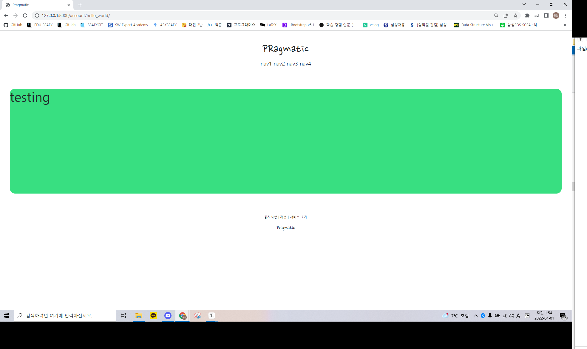

## READEME

### PINTEREST 만들기

- 각 일자별로 학습한 내용은 TIL.md에 저장되어있습니다.

## 사용언어

- Python
- Django
- HTML
- CSS
- MariaDB

### 0330

- 7강까지 듣고 초기 세팅을 마쳤다.
- 나머지 부분은 다 해봤는데, 처음으로 env를 통해 Django의 SECRET KEY를 비공개하는 방법을 배웠다. (커밋을 다 해놓고 알았다.,.,)
- 레포를 삭제하고 다시 만들어야겠다. 
- 그래도 다음부터는 꼭 git ignore에 세팅을 다 마치고 민감한 정보를 다 비공개 처리하고 첫 커밋을 해야겠다! 
- 다행히 커밋이 중요한 부분은 아니고  setting 부분이라서 괜찮을 것 같다. 배운 부분도 TIL에 정리 해놔서 괜찮다 나는 괜찮다~~

### 0331

- 오늘은 11강까지 듣고 마찬가지로 여러가지 SETTING을 했으며, HTML을 구성해봤다.
- 기초적으로 구성하는 부분에서 일단 개발자도구로 css를 적용해보고 그 후에 HTML상에서 적용하는 것도 좋을 것 같다.
- STATIC에 대해서 복습해서 좋았다.
- 구글 폰트를 사용하는 방법을 배웠다.
- 마진같은거 설정할 때 뭔가 부트스트랩을 아직 사용하지 않아서 조금 어색했다. CSS가 그래도 필수적인 요소인 것 같다. 
- Extends와 include를 다시 복습했는데, 기존에 사용했던 것보다 훨씬 include를 많이 세분화하는 것 같다.
  - 그 이유는 아무래도 가독성과 유지보수를 위해서인 것 같다.
- 오늘 만든 페이지 ! 

### 0404

- 19강까지 수강했다.
- 지금까지는 CSS와 기본 DB 설정을 배웠고 내일부터는 CRUD 기반 웹 설계를 본격적으로 시작한다.

### 0405

- 생각보다 강의가 너무 어렵다. 진짜 클론코딩으로 따라치는 기분이다 ㅠㅠ 따로 공부를 해야지
- 현재 회원가입 기능 로그인 기능을 만들었는데, 장고에서 다 제공을해준다... 이거 완전 개꿀이다. 
- 문제 사항으로는 django에서 Class 기반 CRUD들이 자동으로 import가 안된다.. 나름 따라치는 것도 좋지만 문제를 해결해야할 것 같다.
- reverse,reverse_lazy 공부하기, next, login_redirect_url 공부하기, class를 url에서 사용할 때 as_view 왜하는지 알아보기 

